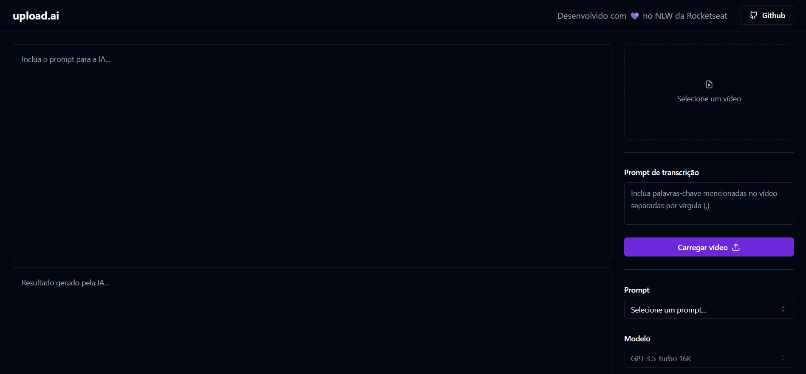
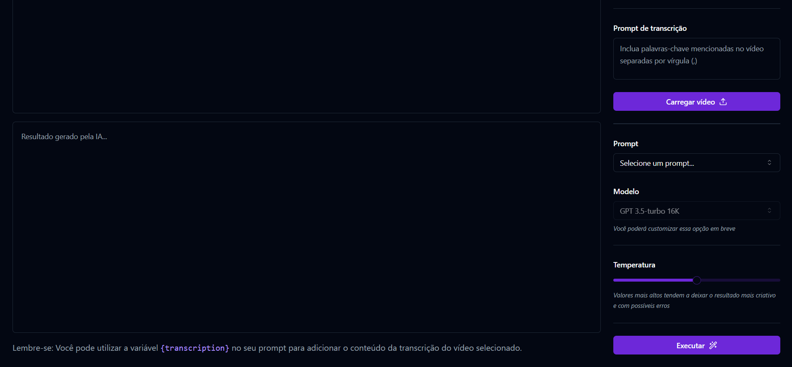

# Upload AI
Project developed using artificial inteligence during the NLW event from Rocketseat. In this project, the user can upload a video and a title and a description will be generated based on the audio of the video.

## Technologies used:
- React
- Typescript
- Ffmpeg
- Radix-ui
- Ai library
- Shadcn-ui
- Tailwindcss

## Images

